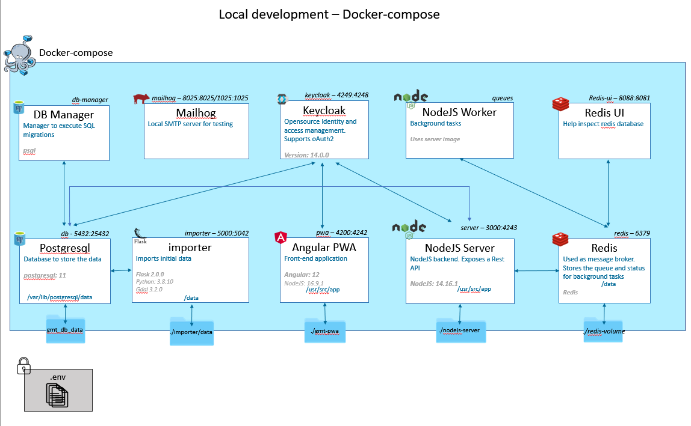
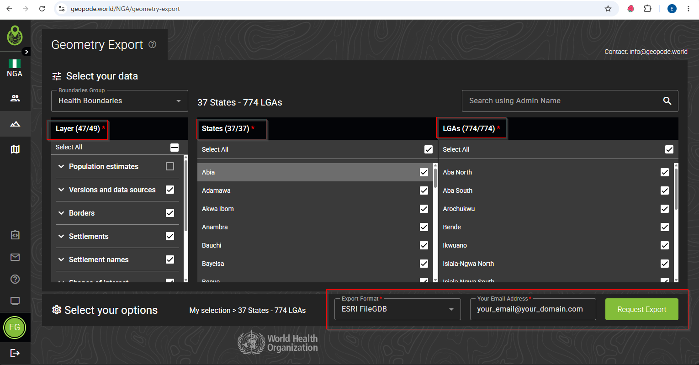

# Geospatial Microplanning Toolkit


# Overview

## Docker Diagram



# Development Environment

## Prerequisites

* WSL2
* Docker for windows

Note a pure linux environment should also work.


# Initial setup

## 1. Install Just

This tool helps organize shell scripts to assist in the dev environment setup.

[Source](https://github.com/casey/just).

The version packaged by Debian is quite old, so install using either `npm` or `pipx`.

### Installing with `npm`

```sh
curl -o- https://raw.githubusercontent.com/nvm-sh/nvm/v0.40.3/install.sh | bash
# restart shell
nvm install --lts
nvm use --lts

npm install -g rust-just
```

### Installing with `uv`

```sh
uv tool install rust-just
```

### Installing with `pipx`

```sh
pipx install rust-just
```

## 2.  Checkout repo

For the rest of the steps, it is assumed your are in a terminal at the root, e.g. `~/git/GMT`

## 3.  Build docker images

`just build-images`

## 4.  Population raster

Go to https://wopr.worldpop.org/?NGA/Population/

and download the latest "Gridded population estimates (~100m) for Nigeria"

Put it in the repo under `<repo root>/importer/data/rasters/input/pop_4326.tif`

## 5. Data

For an initial data import, we'll start from the data available in GeoPoDe Nigeria.

**Important!**  Select Health Boundaries, all layers except population, all States, LGAS, and the file format ESRI FileGDB.  See the screenshot below



Click Request Export
Please be patient, the export can take a while to generate

Unzip the zip to `<REPO ROOT>/importer/data`

You should have `<REPO ROOT>/importer/data/GEOPODE_GEOMETRY_EXPORT.gdb`

`just import-geopode-data`


## 6.  Keycloak

`just rebuild-keycloak-image`

## 7.  Start local docker containers

`just start`

Then open a browser and goto `http://localhost:4242/`


