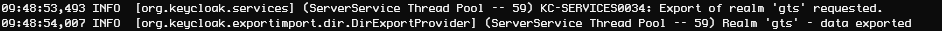

# Export realm

Keycloak container has to be running.

## export

    docker exec -it `docker ps -aqf "name=gmt_keycloak"` keycloak/bin/standalone.sh \
    -Djboss.socket.binding.port-offset=100 \
    -Dkeycloak.migration.action=export \
    -Dkeycloak.migration.provider=dir \
    -Dkeycloak.migration.dir=/tmp/keycloak-export  \
    -Dkeycloak.migration.realmName=gmt

If the export went well, you should see it in the logs as such:

You can now interrupt the running container by hitting <kbd>ctrl</kbd>+<kbd>C</kbd> or <kbd>Cmd</kbd>+<kbd>C</kbd>.

## retrieve the export file

You first need to find the executing _keycloak_ container.

    docker ps --filter ancestor=jboss/keycloak:7.0.0

Copy the **container id** or remember the first three characters.

Repatriate the export file on your computer

    docker cp `docker ps -aqf "name=gmt_keycloak"`:/tmp/keycloak-export/gmt-realm.json /tmp/gmt-realm.json.new

You now have the export file on your desktop.

ℹ _You can also export the realm users that are located in /tmp/keycloak-export/. There can be multiple export file depending on the number of users. These files are suffixed with a number like gmt-users-0.json._